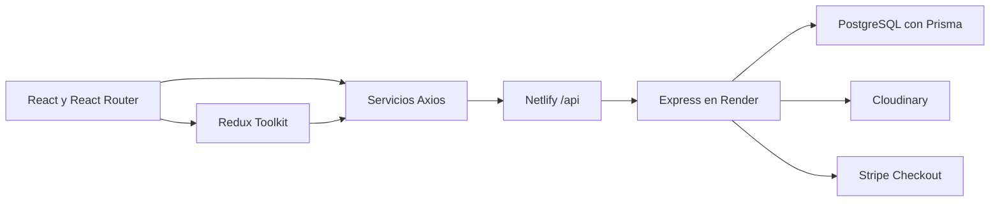

# NeoKensei Chronicles · Frontend

Proyecto final de **Full Stack Developer + IA · Módulo 3**. NeoKensei Chronicles es una tienda de figuras y coleccionables ambientada en un universo ficticio de acción, magia y tecnología.

Este repositorio contiene la aplicación web en React: catálogo, favoritos, carrito, pago con Stripe Checkout y administración de productos. La API, PostgreSQL y las integraciones privadas se encuentran en el repositorio de backend.

## Acceso al proyecto

| Recurso | Enlace |
| --- | --- |
| Tienda en Netlify | [neokenseichronicles.netlify.app](https://neokenseichronicles.netlify.app) |
| API en Render | [backend-lite-sprint13.onrender.com](https://backend-lite-sprint13.onrender.com) |
| Estado de API y base de datos | [GET /health](https://backend-lite-sprint13.onrender.com/health) |
| Repositorio frontend | [espejosara/clase13project](https://github.com/espejosara/clase13project) |
| Repositorio y documentación backend | [espejosara/backend-lite-sprint13](https://github.com/espejosara/backend-lite-sprint13) |

**Nota para la evaluación:** el backend utiliza el plan gratuito de Render. Tras 15 minutos sin tráfico, el servicio puede suspenderse; la siguiente petición necesita arrancarlo de nuevo. Conviene esperar aproximadamente un minuto antes de reintentar si el catálogo o el login tardan en responder. No es un plazo garantizado. [Documentación de Render](https://render.com/docs/free#spinning-down-on-idle).

## Contenido

- [Credenciales de prueba para evaluación](#credenciales-de-prueba-para-evaluación)
- [Objetivos y funcionalidades](#objetivos-y-funcionalidades)
- [Arquitectura y decisiones técnicas](#arquitectura-y-decisiones-técnicas)
- [Instalación y ejecución local](#instalación-y-ejecución-local)
- [Variables de entorno](#variables-de-entorno)
- [Rutas de la aplicación](#rutas-de-la-aplicación)
- [Flujos principales](#flujos-principales)
- [Pruebas y scripts](#pruebas-y-scripts)
- [Despliegue en Netlify](#despliegue-en-netlify)
- [Estado de dependencias](#estado-de-dependencias)
- [Resolución de problemas](#resolución-de-problemas)
- [Mejoras futuras](#mejoras-futuras)

## Credenciales de prueba para evaluación

Cuentas facilitadas para revisar la aplicación desplegada:

| Rol | Email | Contraseña |
| --- | --- | --- |
| Administrador | `sara@hotmail.com` | `123456` |
| Usuario estándar | `sara@test.com` | `mR6KBdjpa6TTKSF` |

La cuenta **ADMIN** puede entrar en `/admin`, crear y editar productos, subir imágenes a Cloudinary y eliminar productos que no estén vinculados a pedidos. La cuenta **USER** permite evaluar compras, favoritos y rutas privadas sin permisos de administración. Internamente, el backend guarda los roles como `admin` y `user`.

Estas cuentas corresponden al entorno de evaluación; clonar los repositorios no las crea automáticamente en una base de datos local vacía. Para probar localmente, consulta la preparación de usuarios en el README del backend.

### Pago de prueba con Stripe

| Campo | Valor |
| --- | --- |
| Número de tarjeta | `4242 4242 4242 4242` |
| Caducidad | Cualquier fecha futura |
| CVC | `123` |

Realiza la evaluación con Stripe en **modo de prueba**, usando claves `sk_test_...` en el backend y sin tarjetas reales. Estas operaciones simulan el pago sin mover dinero. [Tarjetas de prueba de Stripe](https://docs.stripe.com/testing#testing-interactively).

## Objetivos y funcionalidades

El proyecto aplica los requisitos de administración, autenticación por cookies, imágenes y pagos sobre una base de e-commerce con estado global.

| Área del proyecto | Implementación |
| --- | --- |
| Frontend y Redux | Autenticación, carrito, wishlist, pedidos y notificaciones en [src/store](./src/store). |
| Administración | CRUD y formulario compartido en [AdminProductFormPage](./src/pages/AdminProductFormPage/AdminProductFormPage.jsx). |
| Protección de rutas | [PrivateRoute](./src/components/PrivateRoute/PrivateRoute.jsx) comprueba sesión; [AdminRoute](./src/components/AdminRoute/AdminRoute.jsx) comprueba rol. El servidor vuelve a autorizar las operaciones. |
| Integración | [Axios con credenciales](./src/api/axios.js), productos con `FormData` y confirmación de pedidos desde la API. |
| Repositorio y calidad | Componentes reutilizables, CSS Modules, pruebas, lockfile y plantilla de entorno sin secretos. |
| Despliegue | [netlify.toml](./netlify.toml) configura build, proxy a Render y navegación SPA; [GitHub Actions](./.github/workflows/ci.yml) comprueba el frontend. |

Funcionalidades disponibles:

- Catálogo con búsqueda, filtros por categoría, ordenación y productos destacados.
- Ficha de producto con zoom, migas de pan, selector de cantidad y reseñas.
- Avisos de stock bajo y agotado; límites de compra y validación adicional en el backend.
- Carrito con modificación de cantidades, eliminación y resumen de compra.
- Wishlist sincronizada y productos vistos recientemente.
- Registro, login, restauración de sesión al recargar y logout.
- Perfil con historial de pedidos y recomendaciones por afinidad de categorías.
- Checkout en Stripe y confirmación con espera, reintentos y mensajes de error.
- Panel ADMIN con búsqueda, filtros de stock y alertas visuales de existencias.
- Tema claro/oscuro, navegación móvil, imágenes de respaldo y estados de carga y vacío.

## Arquitectura y decisiones técnicas

**Tecnologías:** React 19, React Router 7, Redux Toolkit, React Redux, Axios, Vite 8 y CSS Modules. Las pruebas utilizan Vitest, React Testing Library y jsdom; ESLint revisa el código.



En desarrollo, Axios conecta directamente con `http://localhost:3000`. En el build de producción utiliza `/api`, servido por el proxy de Netlify.

```text
src/
  api/          Peticiones HTTP y adaptación de respuestas
  components/   Controles, layout y componentes reutilizables
  hooks/        Lógica de productos, reseñas, autenticación y tema
  pages/        Pantallas públicas, privadas y administrativas
  router/       Rutas y carga diferida de páginas
  store/        Store y slices de Redux
  utils/        FormData, identificadores, historial local y resúmenes
  test/         Configuración compartida de pruebas
public/         Recursos estáticos e imagen de respaldo
.github/        Workflow de integración continua
```

Las peticiones se concentran en `src/api` para no repetir URLs y configuración. Redux conserva datos compartidos; los campos de formulario y otras interacciones puntuales utilizan estado local. Filtros, totales y listas derivadas se calculan a partir de los datos existentes, con `useMemo` cuando conviene, sin duplicarlos en otro estado.

Crear y editar productos comparte pantalla y componentes de formulario. El router carga las páginas de forma diferida y muestra `Suspense` durante la espera. `SafeImage` sustituye una imagen ausente o fallida por un recurso local.

El JWT está en una cookie **HttpOnly** del backend. No se guarda en Redux, `localStorage` ni `sessionStorage`. El almacenamiento local se limita a preferencias y productos recientes; `sessionStorage` guarda un indicador para el aviso de sesión expirada.

## Instalación y ejecución local

### Requisitos

- **Node.js 22.22.2 o superior dentro de la rama 22**, para cumplir los requisitos de las herramientas instaladas, incluido jsdom. Entorno de verificación: Node.js `22.22.3`.
- npm y Git.
- Backend configurado con PostgreSQL disponible. Para imágenes y pagos también se necesitan las credenciales de Cloudinary y Stripe del backend.

### Preparar ambos repositorios

Desde una carpeta de trabajo:

```bash
git clone https://github.com/espejosara/backend-lite-sprint13.git backend
git clone https://github.com/espejosara/clase13project.git frontend
```

La entrega se organiza en **dos repositorios independientes**, enlazados entre sí. Los nombres locales `frontend` y `backend` facilitan trabajar con ambos, pero no son obligatorios.

Primero sigue el [README del backend](https://github.com/espejosara/backend-lite-sprint13#instalación-y-ejecución-local) para configurar PostgreSQL, generar Prisma Client y arrancar la API en el puerto 3000.

En otra terminal, inicia este frontend:

```bash
cd frontend
npm ci
cp .env.example .env
npm run dev
```

Abre `http://localhost:5173`. `npm ci` instala las versiones resueltas en `package-lock.json`; tanto ese archivo como `package.json` forman parte de la entrega.

## Variables de entorno

| Variable | Desarrollo | Uso |
| --- | --- | --- |
| `VITE_API_BASE_URL` | `http://localhost:3000` | Dirección de la API en desarrollo. En producción el código fuerza `/api`. |
| `VITE_ORDERS_ENDPOINT` | `/orders` | Ruta preferida para el historial. Opcional; la API del proyecto ofrece `/orders`. |

La plantilla está en [.env.example](./.env.example). Tras modificar `.env`, reinicia Vite.

**Todo valor `VITE_*` puede quedar expuesto en el navegador.** Las claves privadas de Stripe, Cloudinary, JWT y PostgreSQL pertenecen al backend. [.gitignore](./.gitignore) excluye `.env` y `.env.*`, incluida `.env.production`, y conserva `.env.example` como plantilla.

## Rutas de la aplicación

| Ruta | Acceso | Pantalla |
| --- | --- | --- |
| `/` | Público | Portada y destacados |
| `/products` | Público | Catálogo |
| `/products/:productId` | Público | Ficha y reseñas |
| `/login`, `/register` | Público | Autenticación |
| `/cart`, `/wishlist` | Sesión iniciada | Carrito y favoritos |
| `/profile` | Sesión iniciada | Perfil, pedidos y recomendaciones |
| `/checkout`, `/checkout/success` | Sesión iniciada | Resumen y confirmación |
| `/admin` | ADMIN | Panel administrativo |
| `/admin/products` | ADMIN | Gestión del catálogo |
| `/admin/products/new` | ADMIN | Crear producto |
| `/admin/products/:id/edit` | ADMIN | Editar producto |
| Cualquier otra ruta | Público | Página 404 |

## Flujos principales

### Sesión y permisos

1. Login y registro llaman a `/auth/login` y `/auth/register`; el backend establece la cookie.
2. Al arrancar se consulta `/auth/me`. Las rutas protegidas esperan a que termine la comprobación de sesión.
3. Axios utiliza `withCredentials: true`. Un `401` en una petición protegida redirige al login y permite mostrar el aviso de sesión expirada.
4. Logout llama a `/auth/logout`. Tras su éxito, Redux elimina los datos de sesión, carrito, favoritos y pedidos.

### CRUD e imágenes

ADMIN utiliza un formulario compartido para altas y ediciones. Se validan campos obligatorios, precio positivo, stock entero no negativo e imagen. El archivo viaja en el campo `image` mediante `FormData`, dejando que el navegador establezca el encabezado multipart con su delimitador. Se admiten JPG, PNG, WebP, GIF y AVIF hasta **5 MB**; crear requiere imagen y editar permite conservar la anterior. El backend vuelve a validar y guarda la URL segura de Cloudinary.

### Carrito, pago y pedido

1. Añadir o cambiar cantidades sincroniza Redux con `/cart`; el servidor comprueba existencias y propiedad del carrito.
2. Checkout solicita `POST /payments/checkout-session`. El backend obtiene los precios de PostgreSQL y devuelve la URL de Stripe.
3. Stripe vuelve a `/checkout/success?session_id=...` o, si se cancela, a `/checkout?canceled=true`.
4. El webhook del backend verifica el pago y registra el pedido. **La URL de retorno no demuestra que el pago esté confirmado.**
5. La pantalla de éxito consulta `/payments/checkout-session/:sessionId/order`, reintenta mientras esté pendiente y ofrece comprobación manual si tarda o falla.
6. Al recibir el pedido confirmado, recarga carrito y pedidos en Redux. Conserva los artículos que sigan en el carrito del servidor.

## Pruebas y scripts

| Comando | Función |
| --- | --- |
| `npm run dev` | Servidor de desarrollo Vite. |
| `npm run lint` | Revisión estática con ESLint. |
| `npm test` | Suite Vitest en una ejecución. |
| `npm run test:watch` | Pruebas en modo observación. |
| `npm run build` | Genera el frontend en `dist/`. |
| `npm run preview` | Sirve el build localmente; no reproduce el proxy de Netlify. |
| `npm run check` | Ejecuta lint, pruebas y build. |

**Verificación local del 8 de septiembre de 2026:** `npm run check` completado, con **107 pruebas correctas en 39 archivos**, lint y build sin errores. La suite comprueba formularios, rutas, roles, cantidades, stock, imágenes de respaldo, perfil y confirmación del pago, incluida la actualización de Redux.

Las llamadas de red se simulan en las pruebas. Estos resultados no sustituyen la comprobación manual de cookies, Cloudinary y Stripe en el despliegue.

## Despliegue en Netlify

1. Conectar el repositorio frontend a Netlify.
2. Usar la raíz como directorio base, `npm run build` como comando y `dist` como carpeta publicada.
3. Configurar Node.js de la rama 22 con una versión que cumpla los requisitos anteriores.
4. Mantener las reglas de [netlify.toml](./netlify.toml): primero `/api/*` hacia Render y después `/*` hacia `/index.html`.
5. En Render, establecer `FRONTEND_URL` y `ALLOWED_ORIGINS` con `https://neokenseichronicles.netlify.app`.
6. Comprobar login, recarga de rutas, alta con imagen y pago de prueba en HTTPS.

El build usa `/api` incluso si existe otro valor de `VITE_API_BASE_URL`; no necesita `.env.production`. Para cambiar la API en producción hay que actualizar el proxy. Desde el navegador, las peticiones de la tienda van al dominio de Netlify, que las reenvía a Render.

[GitHub Actions](./.github/workflows/ci.yml) ejecuta instalación, lint, pruebas y build en cada pull request y en los push a `main`. El workflow valida el código; la publicación la gestiona Netlify con su integración Git.

## Estado de dependencias

Auditoría consultada el **8 de septiembre de 2026** sobre el lockfile de esta entrega:

| Comando | Resultado |
| --- | --- |
| `npm audit` | 1 aviso alto asociado a `browserslist`. |
| `npm audit --omit=dev` | 0 vulnerabilidades reportadas. |

Browserslist forma parte de las herramientas de desarrollo y compilación. El informe indica una corrección disponible; queda pendiente actualizarla y validar lint, pruebas y build. Excluir desarrollo del informe no elimina el riesgo en el proceso de construcción. Detalle: [GHSA-c83g-rgw3-j3cx](https://github.com/advisories/GHSA-c83g-rgw3-j3cx) y [GHSA-73wf-gq98-2v4g](https://github.com/advisories/GHSA-73wf-gq98-2v4g).

`package-lock.json` conserva versiones reproducibles; no es una garantía de seguridad. Los recuentos pueden cambiar cuando npm incorpora avisos. El backend tiene una auditoría distinta, explicada en su README.

## Resolución de problemas

| Síntoma | Comprobación |
| --- | --- |
| Primer acceso lento | Esperar el arranque de Render y comprobar `/health`. |
| Error de red local | Revisar backend en el puerto 3000 y `VITE_API_BASE_URL`; reiniciar Vite tras editar `.env`. |
| Login no persiste | Revisar credenciales, CORS y atributos de cookie; producción requiere HTTPS. |
| API falla con `npm run preview` | Preview no aplica `netlify.toml`; `/api` necesita el proxy de Netlify o uno equivalente. |
| No aparece el panel | Cerrar sesión e iniciar con ADMIN; el backend requiere rol `admin`. |
| Error al subir imagen | Revisar formato, tamaño y variables Cloudinary del backend. |
| Pedido pendiente | Comprobar webhook y secreto en Render; esperar o pulsar «Volver a comprobar», sin repetir el pago. |
| Node incompatible | Utilizar la versión indicada y volver a ejecutar `npm ci`. |

## Mejoras futuras

Una vez completadas las funcionalidades principales, se plantean las siguientes líneas de evolución:

- Ampliar las pruebas de integración del flujo de compra.
- Incorporar reservas temporales de stock durante el pago.
- Completar el resumen desplegable del checkout en móvil.
- Añadir facturas PDF y gestión de devoluciones.
- Incorporar cupones y promociones validados por el backend.
